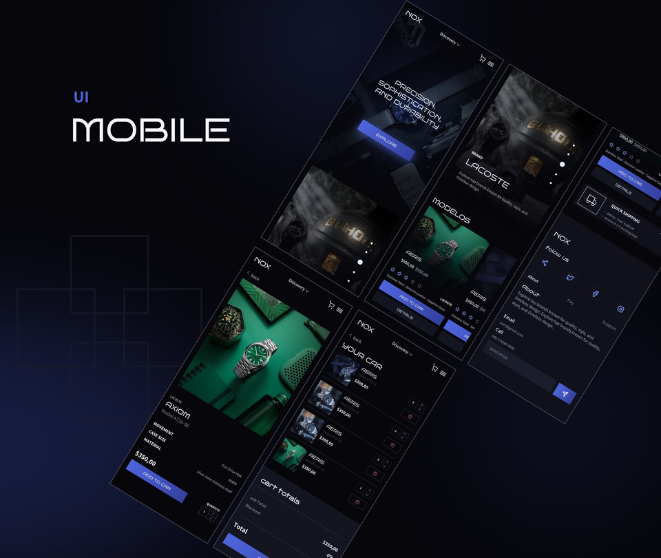
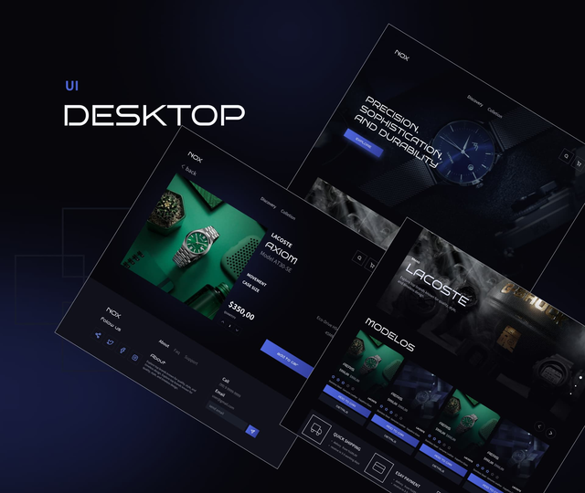

# Nox

  
  
  

## Tópicos

[Sobre a aplicação](#Propósito-e-Objetivo)

[Funcionalidades](#funcionalidades)

[Tecnologias e Ferramentas](#tecnologias-e-ferramentas)

[Instalação e uso](#instalação-e-uso)

 

## Propósito e Objetivo

Colocar em prática tudo o que venho aprendendo ao longo dessa jornada.

 

## Funcionalidades

- [x] adicionar itens ao carrinho
- [x] Páginas dinâmicas com React js.
- [x] rotas iteráveis.
- [x] alterar quantidades e remover produtos.
- [x] Campo de busca.

 

## Tecnologias e Ferramentas

As seguintes tecnologias foram utilizadas no desenvolvimento do projeto:

- [HTML](https://devdocs.io/html/)
- [CSS](https://devdocs.io/css/)
- [JavaScript](https://devdocs.io/javascript/)
- [React Js](https://devdocs.io/Reactjs/)
- [tailwind-css](https://devdocs.io/tailwind-css/)
- [zustand](https://devdocs.io/zustand/)
- [swiper](https://devdocs.io/swiper/)
- [framer-motion](https://devdocs.io/framer-motion/)
- [typescript](https://devdocs.io/react-hook-form)

 

## Design

O design foi feito do zero.

 

<strong>Site : nox-store.vercel.app</strong>

---

Feito com 💙 : by [Felipe_Silva](https://github.com/felipeSilv4dev)

 

  
  

